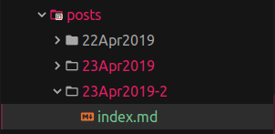
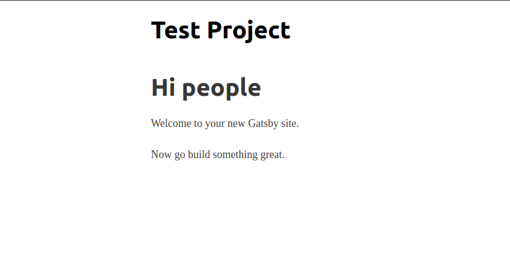

_Phần 3_

## Hiểu được tác dụng của các file

Nhìn vào thư mục `src` ta thấy 3 thư mục con

-   Components: Đại khái ở đây bạn sẽ viết các đoạn code cho các thành phần của một trang web, ví dụ như header, side bar, nav bar, layout... Các thành phần này sẽ hoạt động như các template, và sẽ áp data vào để thành page hoàn chỉnh.
-   Pages: Ở đây sẽ là các code của các trang trong page. Chỗ này sẽ viết các trang như Homepage, About. Các trang post sẽ được sinh tự động từ file Markdown, nên sẽ không đặt ở đây.
-   Images: Thư mục này là thư mục chứa ảnh, được load lên bằng cách config Gatsby (nói sau). Các ảnh này là ảnh cố định trên trang web, ví dụ ảnh nền, ảnh trang chủ, ảnh trang profile... Ảnh trong trang blog sẽ không đặt ở đây.

Mình cũng sẽ tạo thêm một folder nữa là `posts` ở đây, và nó sẽ có tác dụng chứa các bài blog. Đại khái nó sẽ trông như thế này:


Nhìn ở ngoài folder gốc, bạn có thể thấy các file có tên kiểu `gatsby-*.js`. Bạn sẽ cần quan tâm đến các file này, đặc biệt là file `gatsby-config.js` để cài đặt các plugin của Gatsby.

Có vẻ ổn. Let's continue.

## Xác định trước structure của trang web.

Okay mình sẽ làm blog với các trang kiểu như thế này:

```
\ // Trang chủ, list các bài viết
\about // Trang giới thiệu cá nhân
\posts\(post_id) // Một trang blog bất kỳ.
```

Khá là đơn giản thôi, mình không thích cầu kỳ.

Đồng thời blog cũng cần 1 trang 404 để hiện lên khi vào một url không tồn tại.

Nháp xong cấu trúc, chúng ta sẽ bắt đầu build.

## Chỉnh sửa một chút.

Như bạn có thể nhìn thấy trên địa chỉ index đang có một cái ảnh, vài dòng chữ. Rõ ràng chúng ta sẽ không dùng đến cái ảnh. Ta xóa đi file `component/image.js` và xóa đoạn sử dụng cái ảnh này trong `pages/index.js`

```jsx
// pages/index.js
...
import Layout from "../components/layout"
import SEO from "../components/seo"

const IndexPage = () => (
  <Layout>
    <SEO title="Home" keywords={[`gatsby`, `application`, `react`]} />
    <h1>Hi people</h1>
    <p>Welcome to your new Gatsby site.</p>
    <p>Now go build something great.</p>
  </Layout>
)

export default IndexPage

```

Cái Header có màu trông khá sida, mình sẽ chọn cho nó không có màu.

```jsx
// components/header.js
const Header = ({ siteTitle }) => (
    <header
        style={{
            background: `none`,
            marginBottom: `1.45rem`,
        }}
    >
        <div
            style={{
                margin: `0 auto`,
                maxWidth: 960,
                padding: `1.45rem 1.0875rem`,
            }}
        >
            <h1 style={{ margin: 0 }}>
                <Link
                    to="/"
                    style={{
                        color: `black`,
                        textDecoration: `none`,
                    }}
                >
                    {siteTitle}
 ...
```

Trông có vẻ ổn. Còn một vài cái credit các kiểu ở dưới chân, bạn cũng hãy xóa nốt.

```jsx
data => (
    <>
        <Header siteTitle={data.site.siteMetadata.title} />
        <div
            style={{
                margin: `0 auto`,
                maxWidth: 960,
                padding: `0px 1.0875rem 1.45rem`,
                paddingTop: 0,
            }}
        >
            <main>{children}</main>
        </div>
    </>
)
```

File `component/seo.js` chỉnh một số cái header quan trọng trong việc SEO, tạm thời không động đến nó vội.

Đây sẽ là sản phẩm của bạn sau những chỉnh sửa vừa rồi:


Trang web của bạn trông khá clean rồi, nhưng code thì không. Việc để style inline ngay trong các thẻ jsx sẽ làm cho nó rất xấu và khó debug. Bài tiếp theo mình sẽ hướng dẫn các bạn cách dùng file css module để tách riêng styling và js.

